# Dev
### Dépendances
- hugo Go
- npm / yarn
### Installation
(Si vous avez un message d'erreur parlant de module, c'est que vous avez probablement sauté cette étape) 
```shell
npm run install
```

### Développement
Lancez dans deux shells côte à côte
```shell
npm run hugo
```
```shell
npm run watch
```

# Écriture
### 1. Application d'édition de l'histoire 
Nous utilisons [Twine](https://twinery.org/) pour créer et modifier l'histoire.
Téléchargez-le ou utilisez la version web

### 2. Import/mise à jour de l'histoire sur Twine
1.
   - Si vous n'avez pas cloné le repo faites le
   - Si vous avez déjà le repo sur votre pc, faites un pull
2. Sur Twine allez sur l'onglet "Bibliothèque" 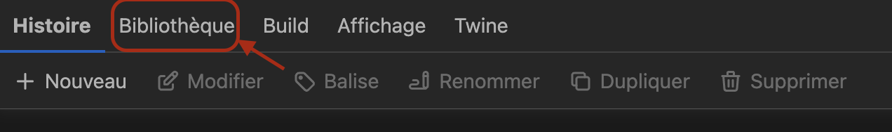
3. Cliquez sur le bouton "Importer" 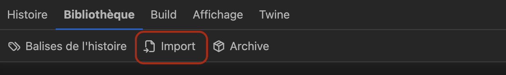
4. Cliquez sur choisir un fichier 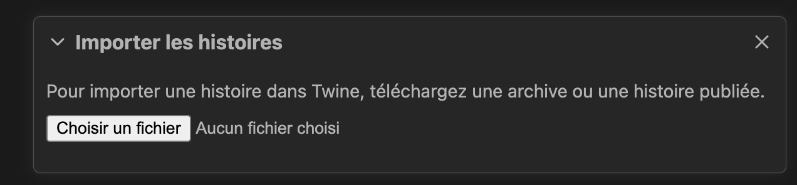
5. Choisissez le fichier de l'histoire que vous voulez importer (story-x.twee)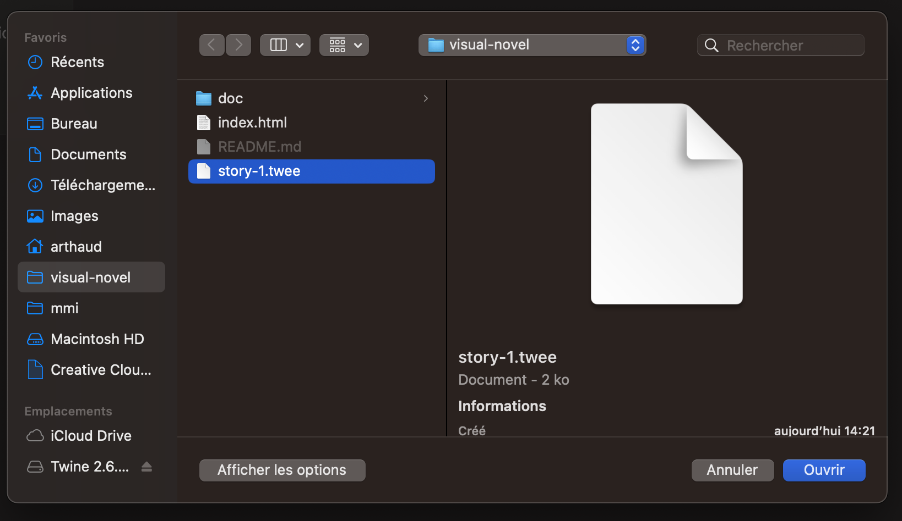
6. 
   1. Si vous avez déjà une histoire avec le même nom Twine vous demandera quelle histoire importer, choisissez votre fichier 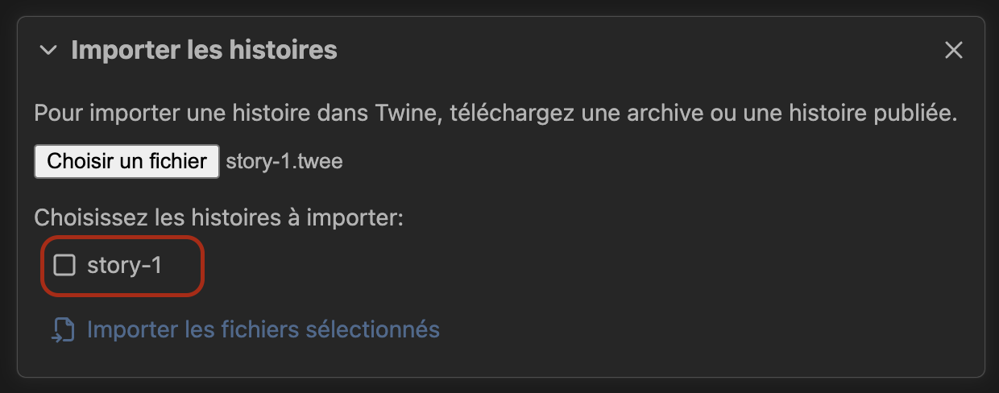
   2. Cliquez sur importer 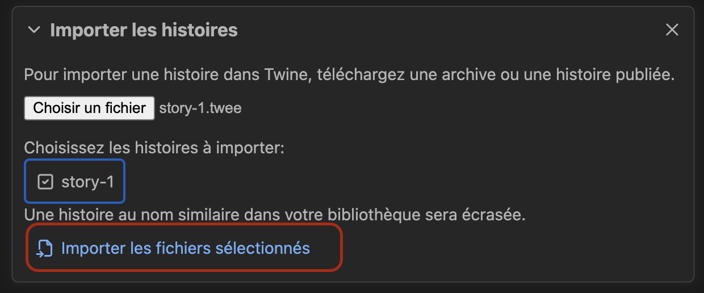
7. Et voilà, l'histoire est importée (ou mise à jour) 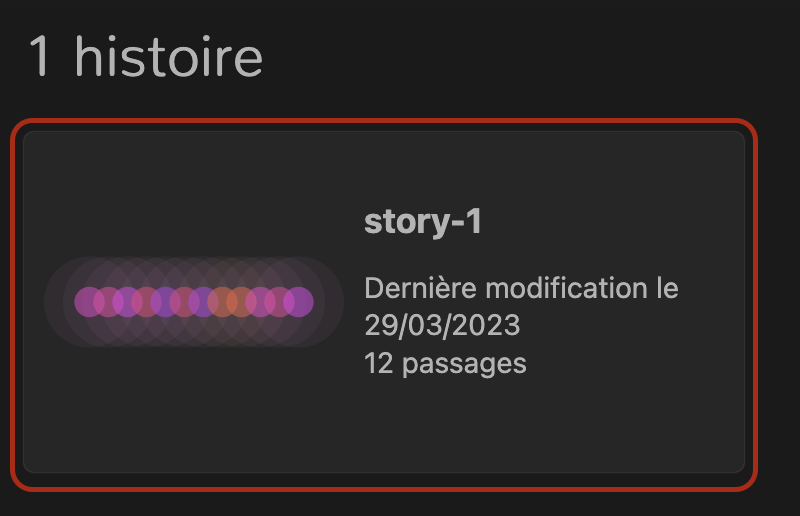

### 3. Écriture et envoi
L'histoire importée sur Twine vous pouvez ajouter les éléments.  
**Pensez à pull avant de travailler**
Une fois que vous avez terminé, exportez l'histoire 
1. Allez sur l'onglet build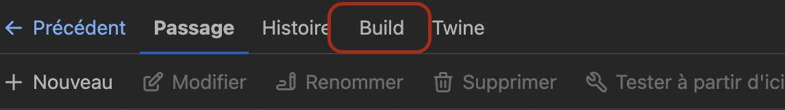
2. Exportez l'histoire en fichier .twee 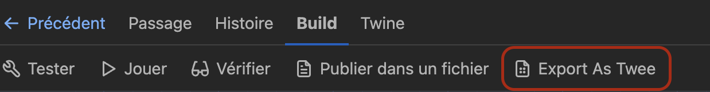
3. Exportez le fichier à la racine du repo 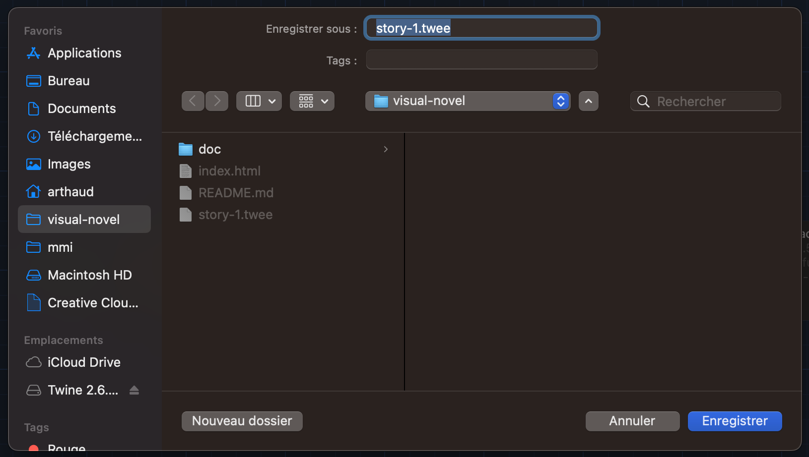
4. Si un du même nom existe déjà, écrasez-le sans pitié 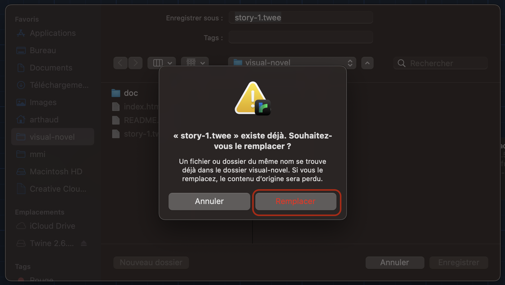

## Syntaxe Twee
### Choix et liens vers d'autres passages
Pour aller au passage 1.8  
`[[Suivant->1.8]]`

Pour faire un choix, mettez plusieurs liens :  
`[[Oui->1.4]]`
`[[Non->1.5]]`

### Liens vers une autre page
`[Fin->/stories/ending]`

### Dialogues
Faire parler le personnage principal  
`@(Jhonette Doe): Lorem ipsum dolor sit amet` 

Faire parler un personnage secondaire  
`@Jhonette Doe: Lorem ipsum dolor sit amet`  

Faire parler un personnage sur le papier
`@@Jhonette Doe: Lorem ipsum dolor sit amet`

Afficher des pensées  
`@@ Lorem ipsum dolor sit amet`  

### Mettre une image
Largeur complète  
``  

Moitié gauche  
``  

Moitié droite  
``

Moitié centrée  
``

Largeur pleine sans marge à gauche ni à droite 
``

### Texte
Gras  
`''Lorem ipsum dolor sit amet''`

Italique  
`//Lorem ipsum dolor sit amet//`