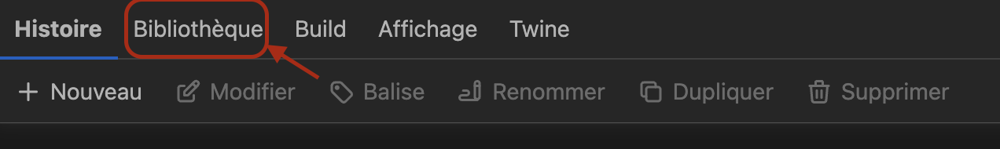
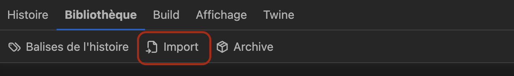
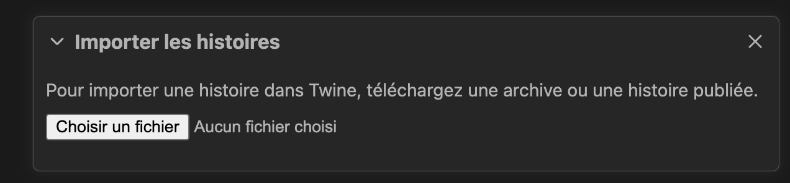
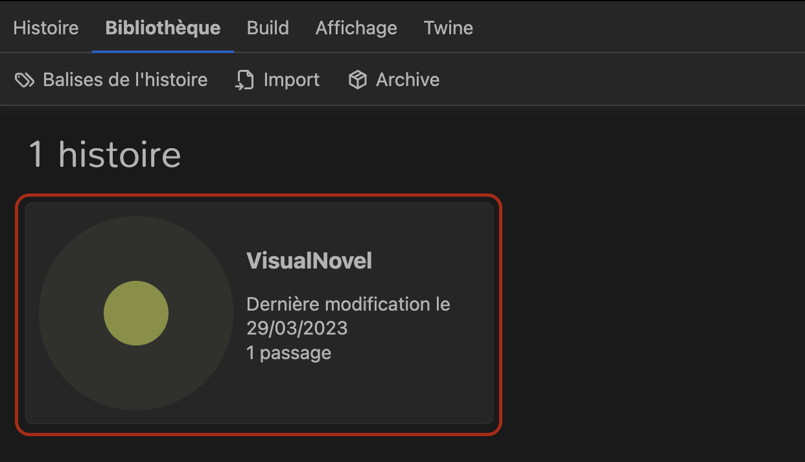

# Mise en place
### 1. Application d'édition de l'histoire 
Nous utilisons [Twine](https://twinery.org/) pour créer et modifier l'histoire.
Téléchargez-le ou utilisez la version web

### 2. Import de l'histoire sur Twine
1. Clonez ce repo sur votre pc
2. Sur Twine allez sur l'onglet "Bibliothèque" 
3. Cliquez sur le bouton "Importer" 
4. Cliquez sur choisir un fichier 
5. Choisissez le fichier index.html 
6. Et voilà, l'histoire est importée 

### 3. Ecriture
L'histoire importée sur Twine vous pouvez ajouter les éléments.  
**Pensez à pull avant de travailler, et à push à la fin**